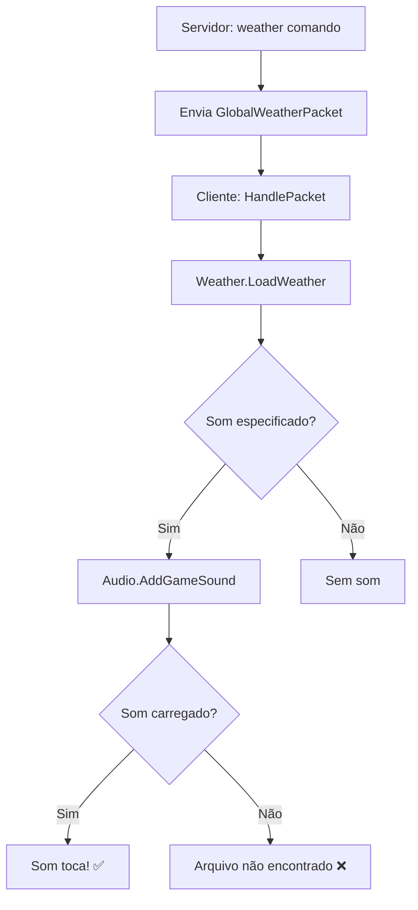

# 🔊 Como Verificar Por Que o Som Não Toca

## 📋 Checklist Rápido

### 1. Verifique se o arquivo de som existe
```bash
# Windows
dir "D:\Seu Jogo\Client\resources\sounds\chuva.wav"

# Linux/Mac
ls -la ~/Seu\ Jogo/Client/resources/sounds/chuva.wav
```

### 2. Verifique os Logs do Cliente

Após rodar o comando `weather` no servidor, procure no console do **CLIENTE** por:

```
[Weather] Loading weather: AnimationId=dcd0472c-264b-4e8f-9250-065fd54460c2, Sound='chuva', Volume=0.3, Intensity=50
[Weather] Attempting to play sound: 'chuva'
[Weather] Sound started successfully!
```

**Se aparecer:**
- ✅ `Sound started successfully!` → O som foi carregado com sucesso
- ❌ `Failed to start sound: 'chuva'` → O arquivo não foi encontrado ou formato inválido
- ❌ `No sound specified for this weather` → O servidor não enviou o nome do som
- ❌ `Intensity is 0, not playing sound` → A intensidade está em 0

### 3. Teste com o Console do Servidor

```
weather dcd0472c-264b-4e8f-9250-065fd54460c2
```

**Deve aparecer:**
```
    Global weather set!
    Animation ID: dcd0472c-264b-4e8f-9250-065fd54460c2
    X Speed: 2
    Y Speed: 3
    Intensity: 50%
    Sound: chuva (Volume: 30%)
```

Se aparecer `Sound:` sem nome, significa que a configuração não tem o campo `Sound`.

### 4. Verifique o Config do Servidor

Abra `Server/resources/config.json` e procure por:

```json
"Weather": {
  "EnableAutomaticWeather": true,
  "WeatherTypes": [
    {
      "Id": "rain",
      "Sound": "chuva",        ← TEM QUE TER ISSO
      "SoundVolume": 0.3,      ← E ISSO
      "Intensity": 50          ← E INTENSITY > 0
    }
  ]
}
```

### 5. Teste Manual de Som

No código do cliente, você pode testar diretamente:

```csharp
// Cole isso em algum lugar para testar
Audio.AddGameSound("chuva", true);
```

Se esse código funcionar, o problema está na configuração do clima.

### 6. Verifique o Volume do Jogo

1. Abra o jogo
2. Vá em **Opções** → **Som**
3. Verifique se **Volume de Efeitos Sonoros** não está em 0%
4. Teste outro som do jogo (ex: clicar em um item, atacar)

### 7. Formatos de Arquivo Suportados

O Intersect geralmente suporta:
- ✅ `.wav`
- ✅ `.ogg`
- ✅ `.mp3` (dependendo da configuração)

**NÃO suporta:**
- ❌ `.m4a`
- ❌ `.flac`
- ❌ `.wma`

## 🔍 Debugging Avançado

### Adicione Logs Extras no Audio.cs

Edite `Intersect.Client.Core/Core/Audio.cs`:

```csharp
public static Sound? AddGameSound(string filename, bool loop)
{
    Console.WriteLine($"[AUDIO DEBUG] Tentando carregar som: '{filename}'");
    
    if (sGameSounds?.Count > 128)
    {
        Console.WriteLine($"[AUDIO DEBUG] ERRO: Máximo de 128 sons atingido!");
        return null;
    }

    var sound = new Sound(filename, loop, 0);
    
    if (sound.Loaded)
    {
        Console.WriteLine($"[AUDIO DEBUG] Som '{filename}' carregado com sucesso!");
    }
    else
    {
        Console.WriteLine($"[AUDIO DEBUG] ERRO: Falha ao carregar som '{filename}'");
    }
    
    sGameSounds?.Add(sound);

    return sound;
}
```

### Verifique o ContentManager

O arquivo de som precisa estar carregado no `GameContentManager`. Verifique se:

1. O arquivo está na pasta `resources/sounds/`
2. O nome do arquivo está **sem extensão** no código (ex: `"chuva"` e não `"chuva.wav"`)
3. O arquivo não está corrompido

### Teste com um Som Existente

Se você tem outros sons funcionando no jogo, tente usar o nome deles:

```json
{
  "Sound": "footstep",  ← Use um som que você SABE que funciona
  "SoundVolume": 0.5
}
```

## ✅ Solução Rápida

Se nada funcionar, tente isso:

1. **Copie um som que já funciona** no jogo
2. **Renomeie para `chuva.wav`**
3. **Coloque em `resources/sounds/`**
4. **Reinicie o cliente**
5. **Teste novamente**

## 📊 O Que Deve Acontecer



## 🆘 Ainda Não Funciona?

Forneça essas informações:

1. **Log completo do cliente** (procure por `[Weather]`)
2. **Log do servidor** (quando executar o comando)
3. **Conteúdo do `config.json`** (seção Weather)
4. **Lista de arquivos** em `resources/sounds/`
5. **Outros sons funcionam?** (ex: música, efeitos)

## 💡 Dica Final

Se o clima visual aparece mas o som não:
- ✅ O pacote está chegando ao cliente
- ✅ A animação está funcionando
- ❌ **O problema é só o som**

Foque em:
1. Verificar se o arquivo existe
2. Testar com `Audio.AddGameSound("chuva", true)` diretamente
3. Verificar volume do jogo
4. Testar com outro arquivo de som
